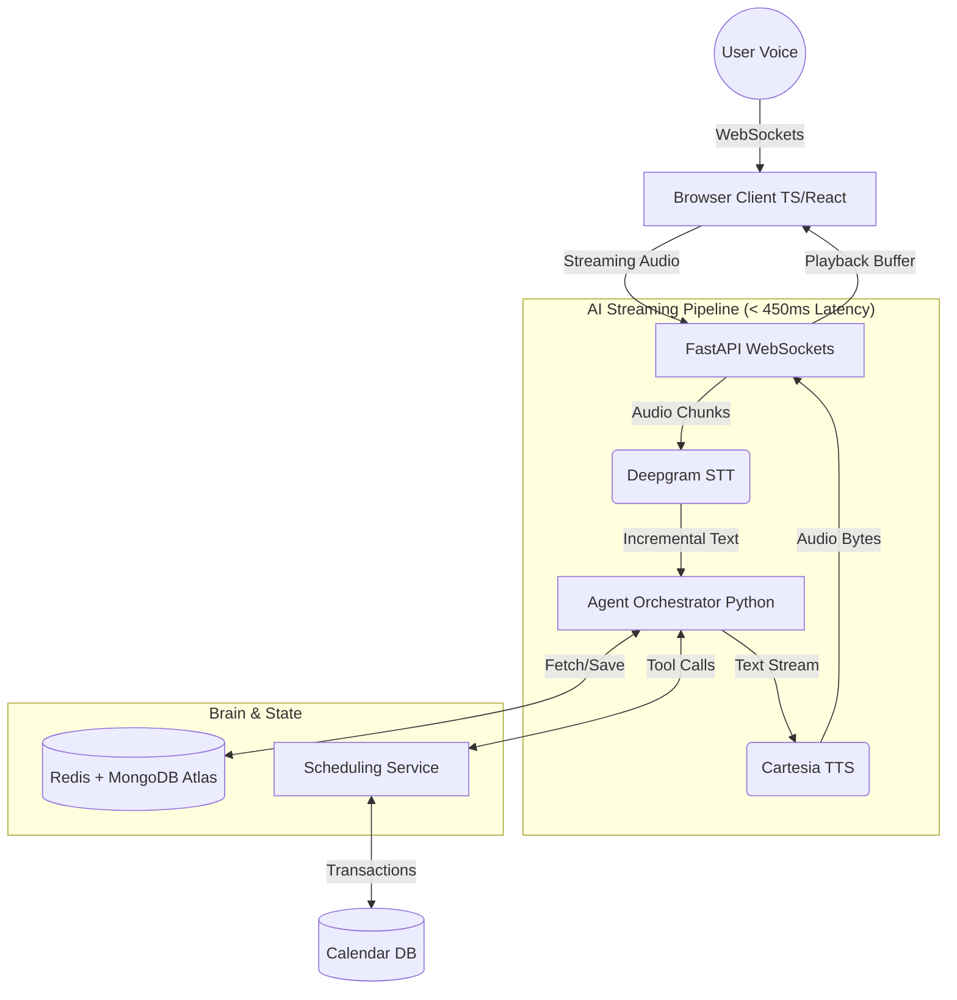

# Clinical Voice AI - System Architecture & Design

This document details the system design for the Real-Time Multilingual Voice AI Agent (Clinical Appointment Booking). The goal of this design is to produce an **autonomous, low-latency (< 450ms), context-aware conversational agent** using modern AI infrastructure.

---

## 🏗️ 1. Architecture Diagram & Explanation

### Explanation of Components:
- **Streaming Pipeline Principle**: Every component (STT, LLM, TTS) must support **streaming**. We never wait for a full sentence to finish processing before starting the next step.
- **WebSocket Gateway (FastAPI)**: Maintains a persistent, bi-directional connection with the frontend to eliminate HTTP overhead.
- **LLM Agent Orchestrator**: The "Brain". It manages conversation state, tool calling (e.g., `book_appointment()`), and generates text responses based on system prompts + memory.
- **Memory Service**: Fast K/V storage (Redis) for intense mid-conversation context, and a document database (MongoDB Atlas) for historical patient data.

---

## 🛠️ 2. Technology Stack

This stack balances **rapid development, massive scalability, and cutting-edge low-latency AI performance.**

**Backend: Python + FastAPI**
- *Why:* Python is the industry standard for AI. FastAPI provides native, high-performance async/await and WebSockets out-of-the-box. It easily manages the complex async tasks required to communicate with STT and TTS providers concurrently.

**Frontend: TypeScript + React**
- *Why:* The browser’s `AudioContext` and `MediaRecorder` APIs require strict typing to prevent audio buffer errors. React provides a reactive UI to show transcripts and booking cards dynamically as the call progresses.

**AI & Voice Processing**
- **STT**: *Deepgram Nova-2* (Streaming). It offers the lowest latency speech-to-text in the market (~250ms) and naturally supports Indian languages (Hindi, Tamil, regional English).
- **LLM**: *Groq (Llama-3)* or *GPT-4o*. Groq generates hundreds of tokens per second, bringing our LLM TTFT (Time To First Token) down to ~150ms.
- **TTS**: *Cartesia* or *PlayHT v3* (Streaming). These modern TTS engines can stream audio bytes before completing the full sentence generation, drastically reducing Time-To-Audio.

**Data Layer**
- **Primary Database**: MongoDB Atlas for flexible, cloud-native storage of patients and appointments.
- **Cache & Session**: Redis for ultra-fast session memory and distributed locks to prevent split-second double bookings.

---

## ⚡ 3. Performance Optimization (Sub-450ms Latency)

A typical voice AI pipeline takes 2-3 seconds. Here is how we break it down to **< 450ms**:

1. **VAD (Voice Activity Detection)**: Instead of waiting for a 300ms silence gap to determine the user stopped speaking, we use **Silero VAD** on the edge (browser) or server to detect speech end in < 50ms.
2. **Incremental Punctuation**: Deepgram streams words as they are spoken. We don't wait for the user to finish; we start sending complete clauses to the LLM the moment we detect punctuation.
3. **LLM Prefix Injection (Filler Words)**: While the LLM is determining a complex tool call (e.g., checking a schedule), we inject a fast streaming response like "Let me check the doctor's calendar..." into the TTS engine. This buys the server an extra 1000ms of perceptual latency while masking the background computation.
4. **WebSocket Binary Transport**: We send raw PCM16 audio bytes directly over WebSockets, avoiding JSON serialization overhead.

**Theoretical Latency Breakdown:**
- VAD Trigger: `50ms`
- Final Transcript (STT): `100ms`
- LLM Time To First Token (TTFT): `150ms`
- TTS Time to First Byte: `100ms`
- **Total: ~400ms** to first audio response.

---

## 🗣️ 4. Multilingual System Design

The agent operates across English, Hindi, and Tamil. 

**Implementation Strategy:**
1. **Language Detection**: The STT model is configured to auto-detect language on the first utterance. Deepgram Nova-2 supports multi-language auto-detection.
2. **Dynamic Prompting**: Once the language is detected (e.g., Tamil), the Agent Orchestrator dynamically updates the LLM system prompt: `"You are a clinical AI. Speak strictly in Tamil. Use polite, culturally appropriate medical terminology."`
3. **Persistence**: The detected language is saved to the Postgres user profile. On the next call (Inbound or Outbound), the session defaults to their preferred language automatically.

---

## 🧠 5. Contextual Memory Strategy

The system uses a **Two-Tier Memory Architecture**.

1. **Session Memory (Redis)**
   - *What it holds*: Current intent, pending confirmations, slot suggestions, user tone, partial data (e.g., "The user said 3 PM but hasn't picked a doctor yet").
   - *Why Redis?*: It's fast and automatically expires (TTL) when the session ends.
2. **Long-Term Memory (MongoDB Atlas)**
   - *What it holds*: Patient history, past cancellations, chronic conditions, language preferences.
   - *Injection*: When a call starts, we fetch the Patient Profile and inject a 3-sentence summary into the LLM system prompt (e.g., "Patient is a 45yo diabetic. Last visited Dr. Sharma 2 months ago in Hindi.").

---

## 📅 6. Scheduling Engine & Conflict Logic

Booking an appointment requires strict transactional integrity. We cannot risk double-booking a doctor.

**Tool Call Workflow:**
1. User: "I want to see Dr. Smith tomorrow afternoon."
2. Agent calls `check_availability(doctor="Smith", date="tomorrow", period="afternoon")`.
3. The engine queries MongoDB. If the doctor has slots at 2:00 PM and 4:00 PM, the Agent replies: "Dr. Smith is available at 2 PM and 4 PM. Which works better?"

**Handling Conflicts (Double Booking Prevention):**
- **Optimistic Locking**: When the user selects "2 PM", the API places a **Redis Lock** on that specific slot (`slot:smith:20241025:1400`) for 60 seconds.
- Within those 60 seconds, the agent asks for final confirmation ("Are you sure about 2 PM?").
- If another patient asks for Dr. Smith at 2 PM while it's locked, the agent reads the lock and says: "That slot was just taken. How about 4 PM?"

---

## 📞 7. Outbound Campaign Mode

The system uses **Celery + Redis Queues** to schedule asynchronous background jobs.

**Workflow (Appointment Reminder):**
1. A cron job selects all patients with appointments in 24 hours.
2. An Outbound Task is queued.
3. The server dials the patient via Twilio/Vonage using SIP interconnect to our WebSocket gateway.
4. The Agent initiates: *"Hello! This is City Hospital. You have an appointment with Dr. Sharma tomorrow at 3 PM. Say 'Confirm' to keep it, or 'Reschedule' to change the time."*

**Graceful Rejection:**
If the user says: "I don't need this anymore, don't call me."
- Agent replies: "Understood, I will cancel the appointment and remove you from our reminder list. Have a great day."
- Agent triggers `cancel_appointment()` and `opt_out_reminders()` database hooks.

---

## 🛑 8. Barge-In Handling (Bonus)

**Barge-in** lets the user interrupt the AI mid-sentence.
- The browser streams audio continuously.
- If the AI is currently speaking (playing TTS audio), the frontend uses Acoustic Echo Cancellation (AEC) to subtract the AI's voice from the microphone.
- If the server receives non-empty audio chunks from the user (detected via VAD) *while* the TTS is playing, it triggers an **Interrupt Event**.
- The server instantly abruptly cuts the audio stream, clears the TTS generation queue, and immediately starts processing the new user audio.
- The LLM updates its context: `[System Observation: User interrupted and said: "No wait, I meant tomorrow."]`, allowing the AI to smoothly correct course.

---

## 🤖 9. Voice Agent Workflow Example

**Scenario: Mid-Conversation Change of Mind**

> **User:** Let's book Dr. Smith for Tuesday morning.
> **Pipeline:** STT -> LLM -> Tool (`get_slots`)
> **Agent:** Dr. Smith has an opening at 9 AM and 11 AM on Tuesday. Which do you prefer?
> **User:** Let's do 9 AM.
> **Pipeline:** Agent locks the slot in Redis. 
> **Agent:** Got it, locking in 9 AM. Shall I confirm this?
> **User (Barge-in):** Wait! Actually, is Dr. Jones available instead?
> **Pipeline:** Server detects interrupt, clears 9 AM lock in Redis, triggers new LLM generation.
> **Agent:** No problem. Let me check Dr. Jones' schedule for Tuesday morning...
